# 毕业设计精选-周边游平台个人管理模块的设计与实现-采用springboot和vue框架开发

<h4 style='color:red'>联系不到我，就看我的主页 </h4> 
 
#### 介绍

介绍一款使用Spring Boot和Vue的框架开发毕业设计，及周边游平台个人管理模块设计与实现，是一个集成化的解决方案，旨在优化和简化周边游服务的管理和用户体验。该系统拥有两个主要角色：管理员和用户。管理员负责平台的全面管理和维护，包括景点管理、房间管理、旅游团管理等。用户则可以浏览和预订景点、房间、旅游团，参与留言板讨论并与客服进行交流。系统通过高效的信息化管理和友好的用户界面，提升了周边游服务的整体效率和用户满意度。

#### 研究背景

目前整个社会发展的速度，严重依赖于互联网，如果没有了互联网的存在，市场可能会一蹶不振，严重影响经济的发展水平，影响人们的生活质量。计算机的发展，不管是从硬件还是软件，都有很多技术储备，每年都有很多的技术和软件产生，纵观各个领域，无一不用互联网软件，办公用的还是电脑居多，但是人手一台智能设备已经变成了现在人们的生活日常，哪怕的普通的老百姓都成了上知天文下知地理的所在，这些都依赖于互联网技术。互联网技术在信息的传播方面是巨大的，而信息的处理就变成了各种产业管理者和维护者的重任。人们已经习惯了互联网的存在，所以经常操作一些互联网产品变成了日常，所以开发一个周边游平台，让人们使用是没有一点问题的，并且在这个过程中不仅能够规范旅游信息管理的使用流程还有信息处理流程，也能让整个信息的传播处理，都存在一种可控制的范围，最重要的是，计算机在旅游信息管理方面可以给管理者提供更好的帮助。

#### 技术栈

后端技术栈：Springboot+Mysql+Maven

前端技术栈：Vue+Html+Css+Javascript+ElementUI

开发工具：Idea+Vscode+Navicate

#### 系统功能介绍

管理员角色  
个人中心：管理员可以查看和更新个人信息，包括用户名、密码等，确保账户安全。  
客服聊天管理：管理员可以与用户进行实时聊天，解决用户的问题和疑问，提高服务响应速度。  
基础数据管理：包括以下子模块：  
房间类型管理：管理不同类型的房间信息，确保房间信息的完整和准确。  
公告类型管理：管理平台公告的分类，方便公告的发布和管理。  
景点类型管理：管理不同类型的景点信息，确保景点信息的准确性。  
旅游团类型管理：管理不同类型的旅游团信息，提供多样化的旅游选择。  
出发时间管理：管理旅游团的出发时间，确保时间安排的合理性。  
出行方式管理：管理不同的出行方式，如自驾、跟团等，满足用户的多样化需求。  
旅游方式管理：管理不同的旅游方式，如深度游、观光游等，提供多样化的旅游服务。  
状态管理：管理各种状态信息，如订单状态、房间状态等，确保系统信息的实时更新。  
景点管理：包括以下子模块：  
录点管理：录入和维护景点信息，确保景点资料的准确和详细。  
景点评价管理：管理用户对景点的评价，提供评价审核和反馈功能。  
景点收藏管理：管理用户对景点的收藏情况，方便用户快速访问收藏的景点。  
景点订单管理：管理景点的预订订单，包括订单的审核、确认和取消等。  
房间管理：管理平台上的房间资源，包括房间的添加、修改、删除等操作。  
旅游团管理：包括以下子模块：  
旅游团管理：管理旅游团的信息，包括旅游团的创建、修改和删除等。  
旅游团留言管理：管理用户对旅游团的留言，提供留言的审核和回复功能。  
旅游团收藏管理：管理用户对旅游团的收藏情况，方便用户快速访问收藏的旅游团。  
旅游团拼团管理：管理用户参与的拼团活动，确保拼团活动的顺利进行。  
游玩路线管理：管理平台上的游玩路线信息，包括路线的创建、修改和删除等。  
公告管理：发布和管理平台公告，确保重要信息及时传达给用户。    
留言板管理：管理用户在留言板上的发言，提供留言的审核和回复功能。  
用户管理：管理平台用户的账户信息，包括用户的注册、信息更新等。  
轮播图信息：管理首页的轮播图，展示重要的景点、房间和旅游团信息，吸引用户的注意力。  

用户角色  
景点：用户可以浏览和搜索平台上的景点信息，查看景点的详细介绍和用户评价。  
房间：用户可以浏览和搜索平台上的房间信息，查看房间的详细介绍和预订情况。  
旅游团：用户可以浏览和搜索平台上的旅游团信息，查看旅游团的详细介绍和用户评价。  
游玩路线：用户可以浏览平台提供的游玩路线，选择合适的路线进行旅游规划。  
公告：用户可以查看平台发布的公告信息，了解最新的活动和优惠信息。  
留言板：用户可以在留言板上发言，与其他用户交流旅游心得和经验。  
个人中心：用户可以查看和更新个人信息，包括用户名、密码、联系方式等，确保账户安全。  
后台管理：用户可以管理个人的订单、收藏夹和购物车等，方便进行预订和购买操作。具体包括：  
景点管理：用户可以管理自己预订和收藏的景点，查看订单状态和评价情况。  
房间管理：用户可以管理自己预订和收藏的房间，查看订单状态和评价情况。  
旅游团管理：用户可以管理自己预订和收藏的旅游团，包括旅游团留言管理、收藏管理和拼团管理。  
游玩路线管理：用户可以管理自己选择的游玩路线，进行旅游规划和调整。  
公告管理：用户可以查看和管理自己关注的公告信息，及时了解最新动态。  
留言板管理：用户可以管理自己在留言板上的发言，查看回复和评价。  
客服：用户可以与平台客服进行实时聊天，解决预订过程中的问题和疑问。  

#### 功能结构设计

本系统主要是基于数据的增加，修改，删除等操作，使用者能够通过提前设定的登录功能进入指定的操作区，这里对使用者设计的功能进行结构展示。
管理员功能结构图的绘制结果如下。管理员登录进入本系统操作的功能包括对景点，房间，旅游团，游玩路线，留言信息等进行管理，可以管理景点评价，景点订单，房间评价，房间订单，旅游团留言，旅游团拼团信息，游玩路线留言信息等。

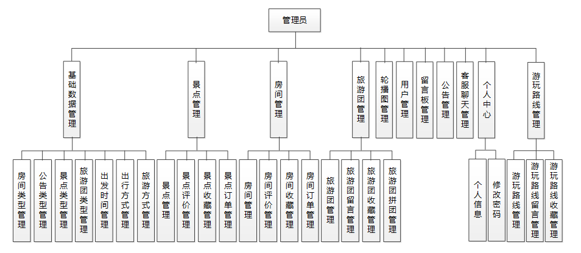

#### 系统流程分析

从系统的角色上分析，每个用户角色都代表了不同的账号身份，而不同的身份则代表着功能的异同，所以首先要区分用户的角色身份问题。设置用户登录需要输入账号和密码，输入的信息必须与数据库里已经存在的账号密码信息进行比对，只有正确的账号和密码才可以进行下一步的页面显示操作，如果不正确的账号密码，则拒绝用户登录，也代表着用户没有继续访问的权限，系统是无法继续提供服务的。

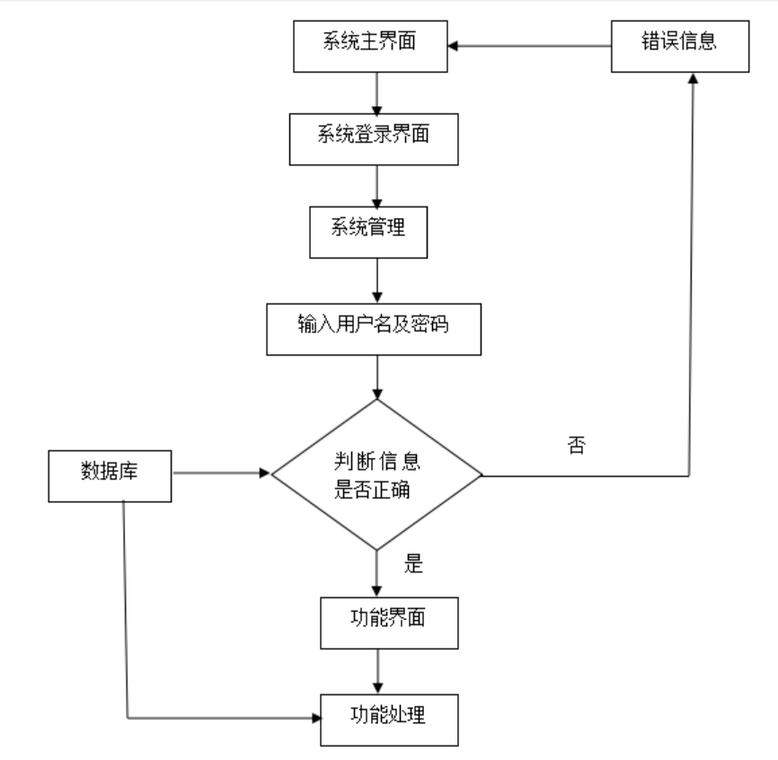

任何一个系统都有一个操作流程，本设计里面，对于任何数据的存储都有一定的合法要求，只有符合设定要求的数据才可以进行存储。具体步骤参考下图。

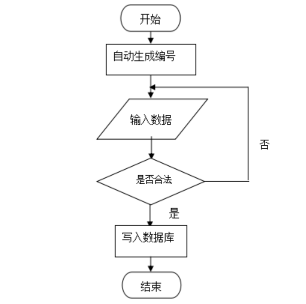

数据的存储并不是一成不变的，当需要对已经存在的数据进行改变的时候，同样也遵循着操作流程，想更改数据首先要确定更改之前的数据是什么，然后输入新的数据是否合法，都要符合流程，只有合法数据才可以被更新到数据库里存储。具体步骤参考下图。

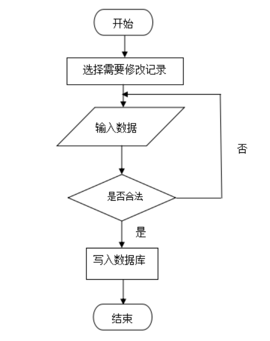

删除操作，在数据存储方面是一件比较慎重的事件，很有可能会产生失误操作，所以一般删除操作的时候都要提示是否删除，确定删除才会更新数据库内容，实现删除目的。具体步骤参考下图。

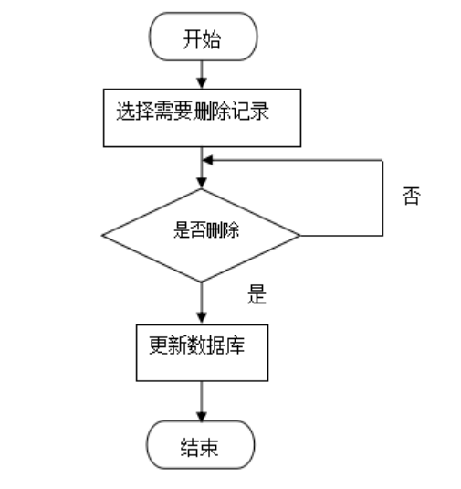

#### 系统作用

周边游平台个人管理模块通过信息化手段，实现了周边游服务的全面管理和高效运营。其具体作用如下：

提升管理效率：系统化管理减少了人工操作，提升了平台管理的效率。  
增强用户体验：提供便捷的浏览、预订和管理功能，提升了用户的使用体验。  
提高服务响应速度：通过客服聊天管理，快速解决用户的问题和疑问，提高服务质量。  
增加信息透明度：通过详细的景点、房间和旅游团信息，增加平台的信息透明度和可信度。  
促进用户互动：通过留言板和论坛功能，增强用户之间的互动和交流，形成良好的用户社区。  

#### 系统功能截图

登录模块

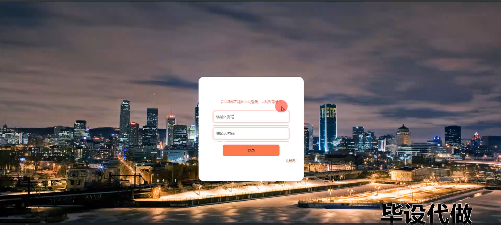

景点模块

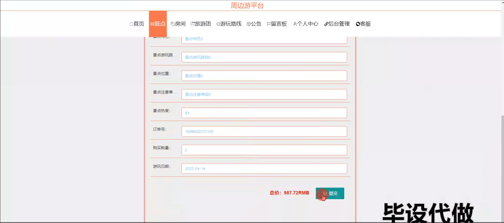

旅游团模块

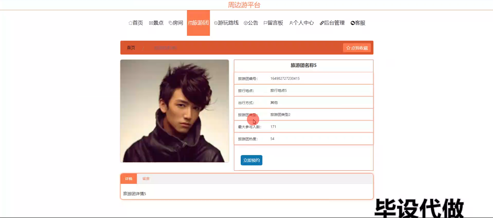

游玩路线

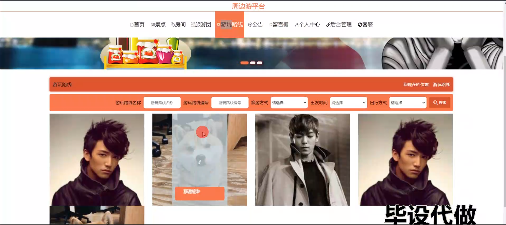

留言板模块

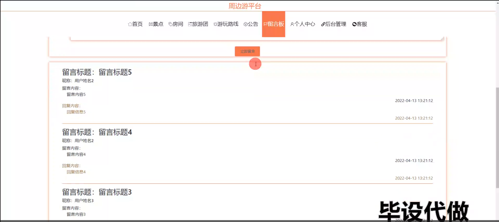

个人中心

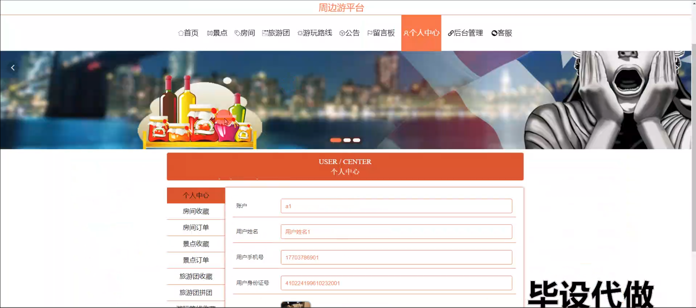

客服模块

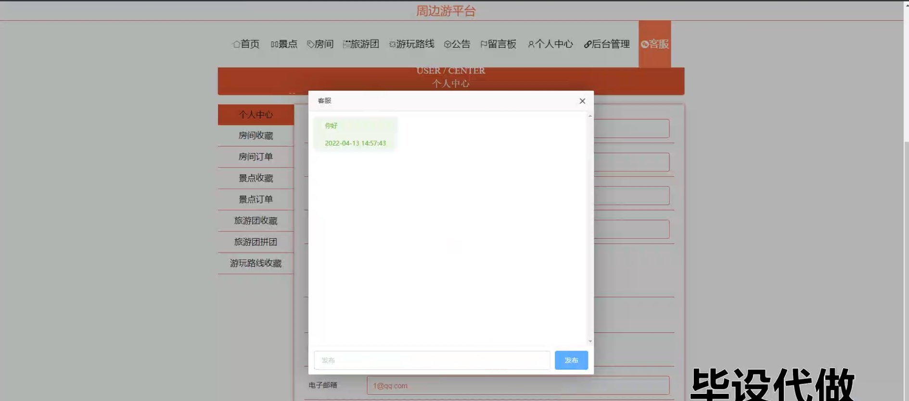

管理员端后台管理

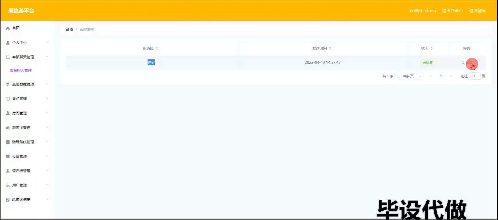

景点订单管理

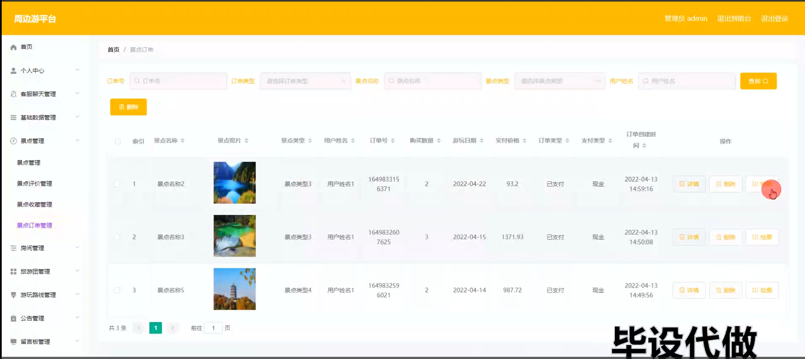

旅游团管理

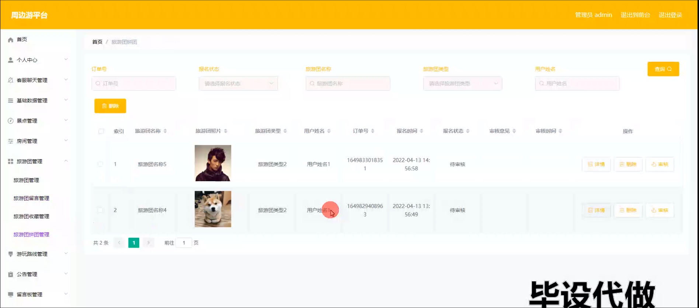

公告管理

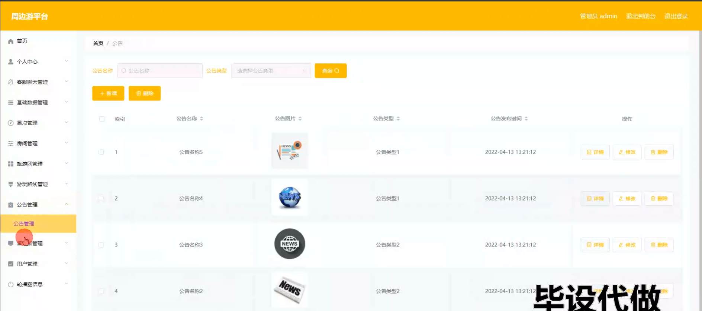

用户管理

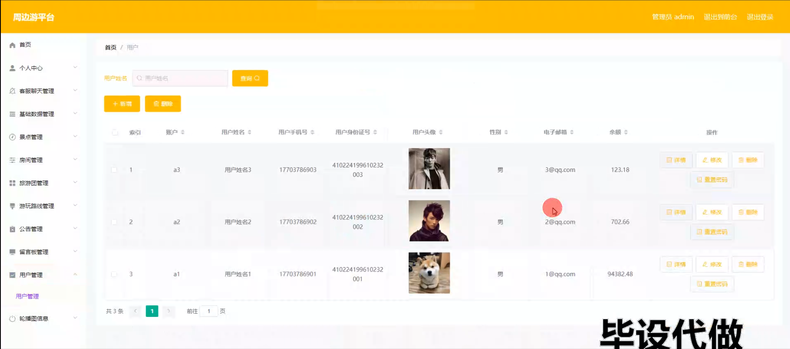

用户端后台管理

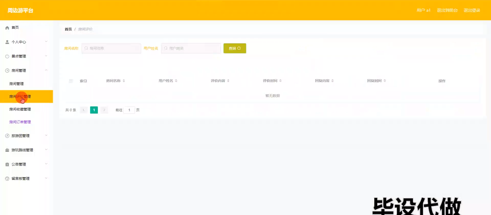

#### 总结

基于Spring Boot和Vue的周边游平台个人管理模块在现代旅游服务中具有重要的应用价值。通过提供全面的功能模块和友好的用户界面，该系统不仅提升了周边游服务的管理效率和用户体验，还增强了平台的信息透明度和服务响应速度。随着信息技术的不断发展，周边游平台将进一步推动旅游服务的数字化和智能化发展，成为旅游服务管理和用户体验提升的重要工具。未来，该系统可以结合更多的智能技术，如大数据分析和人工智能，实现更为精准和高效的旅游服务和管理。

#### 使用说明

创建数据库，执行数据库脚本 修改jdbc数据库连接参数 下载安装maven依赖jar 启动idea中的springboot项目

前台登录页面
http://localhost:8080/zhoubianyoupingtai/front/index.html

后台登录页面
http://localhost:8080/zhoubianyoupingtai/admin/dist/index.html

管理员				账户:admin 		密码：admin

用户				账户:a1 		密码：123456
